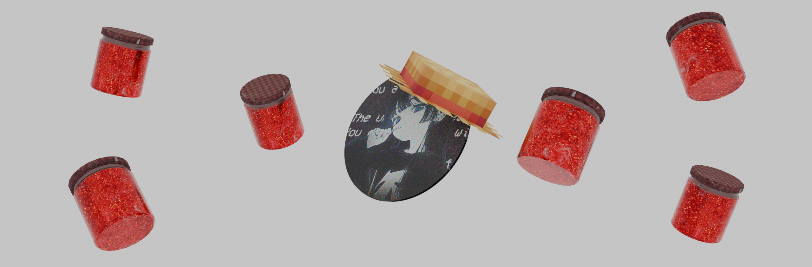

   

**About Me**

My name is Daniil, or Luki, or TheNightlyGod.

I’m a 17-year-old guy who does programming.

I might be underestimating my abilities, but I consider myself an intermediate developer.

I’ve been interested in technology and system administration since I was 6 years old.

I’m a fuckstack(This typo was included on purpose...) developer as well as a 3D artist.

I’m a music lover, so don’t be surprised by the music you see on my Telegram channel.

I own a Meta Quest 3, but I don’t use VR very often.

**Skillset**

Python, C#, TypeScript, Vue.js, Nuxt, Node.js, Docker and Git
